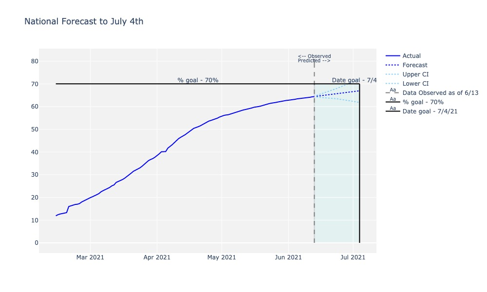
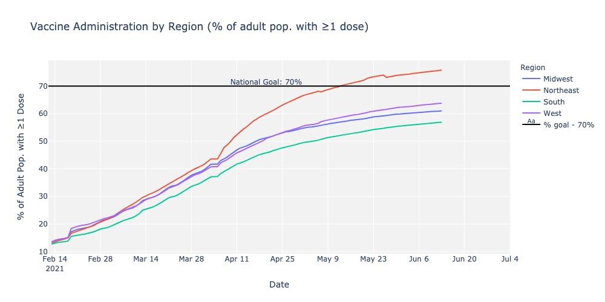

# Time Series Analysis
## Will the US Reach the Biden Administration's Goal of Administering ≥1 COVID-19 Vaccine Dose to 70% of the Adult Population?

On May 4, 2021, United States President Biden announced a goal to administer at least one coronavirus vaccine shot to 70% of the U.S. adult population by July 4th. Read the official statement [here.](https://www.whitehouse.gov/briefing-room/statements-releases/2021/05/04/fact-sheet-president-biden-to-announce-goal-to-administer-at-least-one-vaccine-shot-to-70-of-the-u-s-adult-population-by-july-4th/)

In this report, a time series analysis is performed on the CDC's public vaccine distribution and administration dataset as of June 13, 2021 to predict whether or not the US will meet the target, then provide the Biden Administration a set of recommended actions to take in the final 3 weeks in order to reach the goal.


## Data Source

Data for this analysis was sourced from the CDC's [official COVID-19 Vaccination dataset](https://data.cdc.gov/Vaccinations/COVID-19-Vaccinations-in-the-United-States-Jurisdi/unsk-b7fc), on June 13, 2021. Additional steps were complete to:

- Analyze the adult (age 18+) population only, even while some vaccines have been approved for adolescents
- Focus on the 50 states, District of Columbia, and Puerto Rico, while the source data included US territories and federal jurisdictions
- Engineer a "region" categorizer based on the US Census Bureau's four US regions: Northeast, Midwest, South, and West
- Look across all vaccine partners and vaccine providers


## Methods

Standard preprocessing steps were taken to ensure data hygiene for modeling.

The `statsmodels.tsa` package was used to perform ARIMA and SARIMAX time series analyses on the data and forecast 21 days into the future. I leverage a custom function to grid search the optimal order and seasonal order parameters.

Models were created at the national and regional levels.

An "Administration Rate" feature was engineered to represent how many vaccines were administered per 1 vaccine distributed. This feature yields insights into the root cause of the challenge: vaccine distribution efficiency or vaccine hesitancy in the population.


## National Analysis

The best national model forecasts that 66.96% of the US adult population will have received at least one vaccine dose by July 4th, coming short of the 70% goal. However, the goal is within the upper confidence interval.

Upper confidence interval: 72.93%

Forecast: 66.96%

Lower confidence interval: 61.78%




## Regional Analysis

The Northeast leads the nation, reporting nearly 80% of the adult population has received at least one vaccine dose as of June 13.

The West (63.8%), Midwest (61.1%), and South (57.0%) trail quite significantly. None of these regions are projected to reach the 70% national goal by July 4th.




The south also lags significantly in Administration Rate, which suggests there is vaccine hesitancy as opposed to lack of physical resources in the south.


## Summary & Recommendations

**KEY TAKEAWAYS**


Based on an analysis of the CDC's COVID-19 Vaccine Administration tracker as of June 13, 2021, it is predicted that the US will not reach their goal of administering at least one vaccine dose to 70% of the adult population. However, the goal is not far off, and additional campaigning in the areas lagging behind may help close the gap. 

The northeast region is leading the nation in vaccine administration, having achieved the 70% administration goal in mid-May and continuing an upward trajectory since then. The south is lagging behind in both vaccine administration as a percentage of the adult population and in efficiently administering the vaccines distributed to the region. 

____


**RECOMMENDATIONS**

In the remaining weeks leading up to July 4th, the Biden administration should take the following actions to increase the chances of meeting their goal:

- Continue community-based vaccine education and local outreach efforts, focusing on this aspect of the campaign most

- Launch a nation-wide educational campaign explaining the benefits and risks of COVID-19 vaccination and debunking common misconceptions about the vaccines

- Focus investments in the south


### For Further Information:
Please review the full report in [this jupyter notebook](./report.ipynb) or review the non-technical [presentation](./presentation.pdf)

For any additional questions, please contact kcoop610@gmail.com.


### Repository Structure:

```

├── README.md            
├── report.ipynb 
├── functions.py 
├── presentation.pdf
├── images          
├── data
    └── COVID-19_Vaccinations_in_the_United_States_Jurisdiction.csv
├── styles
    └── custom.css 
└── pdfs
    ├── repo.pdf
    └── report.pdf
 

```